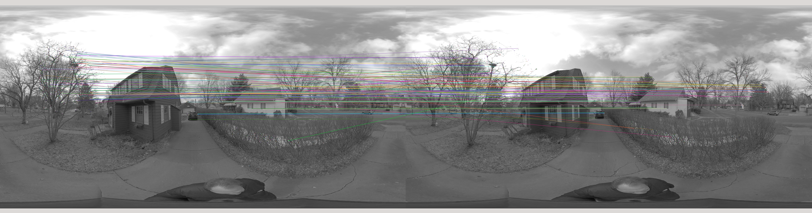
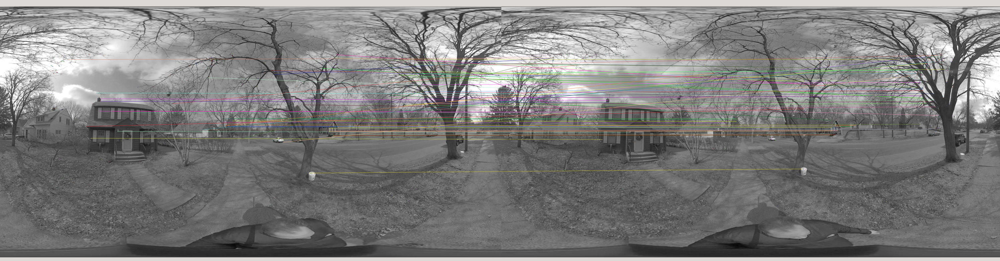

# Omnidirectional camera-based odometry

Goal: generate the path that was walked by the user while they recorded this omnidirectional
video. We’d like to see the locations of the path projected onto this top-down image. The green
dot is the starting point, and the red dot is the ending point.

### Dependencies
* cmake >= 2.8
* make >= 4.1 (Linux)
* OpenCV >= 4.1
* gcc/g++ >= 5.4

### Basic build instructions
1. Clone this repo.
2. Make a build direactory in the top level of project directory: `mkdir build && cd build`
3. Compile: `cmake .. && make`
4. Run the executive: `./ODCO`
5. The code is set to display all keypoints and the matched keypoints for each two consequtive images. The program will wait for a key entry form the user to move on to the next image.

### Steps taken

The following steps are a summery of the my approach to tackle this project:

- Implemented a ring buffer to avoid exessive usage of memory wile processing a sequence of images; thus, preventing potential slowing down of the program 
- Implemented various keypoint detectors such as: Shi-Tomasi, Harris, FAST, BRISK, ORB, AKAZE, and SIFT; Ultimately used FAST method
- Designated a smaller area in the image from where keypoints are allowed to be detected. I noticed the keypoints on the very edges of the images are not reliable
- Implemented differnt keypoint descriptors approaches and uultimately utilized ORB 
- Developed various keypoint matching approaches like Brute Force or FLANN 
- Increase the detection and matched threshold for keypoints to avoid excessive false matches. One particular problematic area were the branches of tress and bushes
- Extracted the Essential Matrix using OpenCV command and inputing the matched keypoints. I assumed the Camera matrix is an identity matrix, which is probably wrong
- Used the Essential Matrix from the two consequtive images to extract the realtive camera rotation and translation
- Started by assuming the starting point has a coordinates of (0, 0, 0), used R and T matrices to update the camera position
- The updated camera positions are displayed on terminal. Did not get the chance to visualize them or superimpose them on the 2D map
- The camera position values are not converted into a distance unit. I assume they are now simply in terms of pixels. However, once camera's parameters are known this issue can be resolves.
- I am aware that this method is not probably the best or even right. However, this was all I could manage in the time I had. 

### Suggestions

- We most probably have to triangulate the two consequtive images to construct the 3D structre of the scence. For this we need camera's calibration parameters
- Once we have an initial map of the environment this could become a SLAM probelm, where we in turn update the 3D map of the environment and the camera's pose.

### Some example images

**Keypoints detected using FAST detector and described using ORB**

